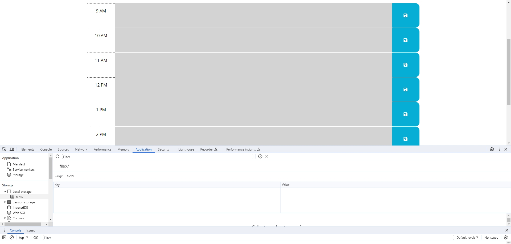
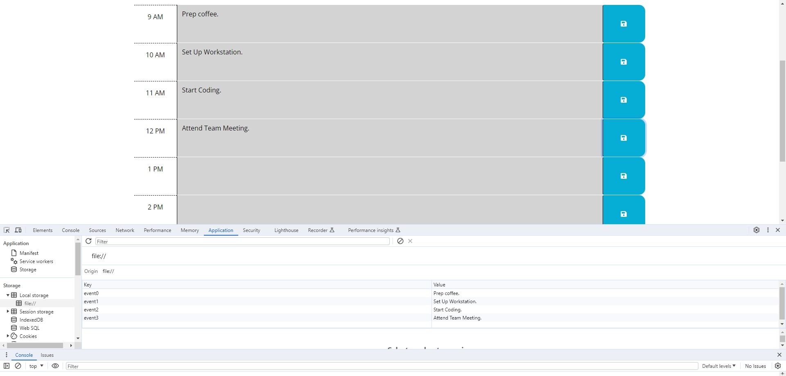
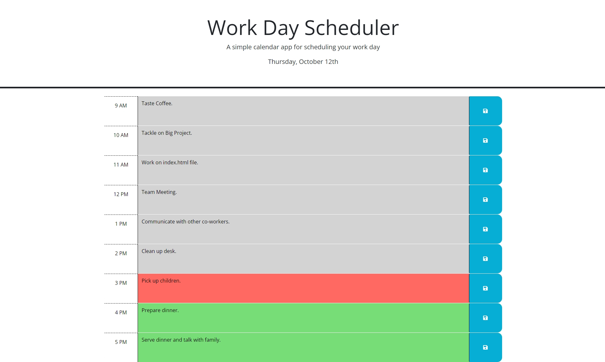
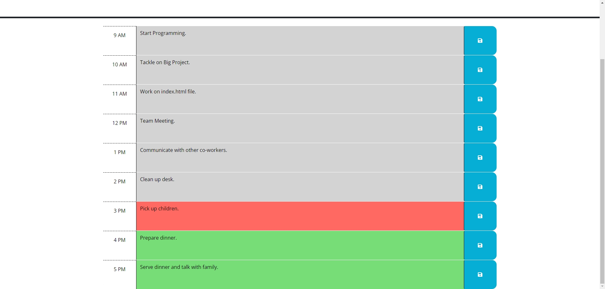
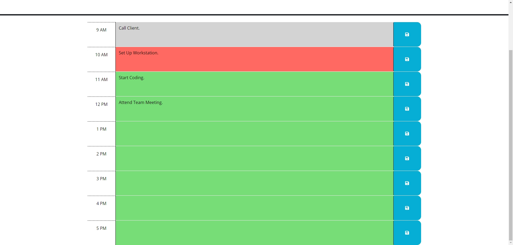
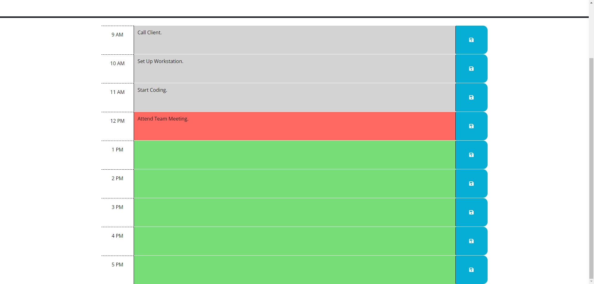
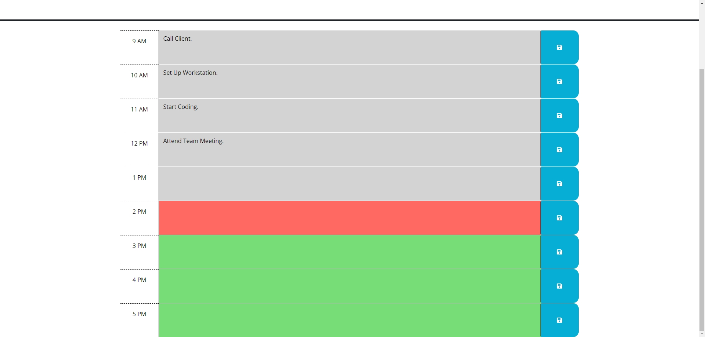

# Day Scheduler

## Description

The motivation to implement the project is to create one task for one of the hours for one day which is the current day. It will help users to manage their task for that hour. It solves the problem of users not having to remember what to do for that certain hour. I learned that you can use literals to create a time block and use local storage to store data and display it in the webpage.

## Table of Contents (Optional)

If your README is long, add a table of contents to make it easy for users to find what they need.

- [Installation](#installation)
- [Usage](#usage)
- [Credits](#credits)
- [License](#license)
- [Badges](#badges)
- [Features](#features)
- [HowToContribute](#how-to-contribute)
- [Tests](#tests)

## Installation

Go to the public GitHub repo page and download the folders and assets. Open the index.html file through a browser.

## Usage

When there is no information saved in local storage:

Tasks are saved into the local storage:

Tasks can be updated:

All tasks are saved into local storage:

All tasks are updated:

Current hour are changed to 10AM:

12 PM:

2 PM:

## Credits

Collaborators:

1. Sichoun Nplhaib Lee: https://github.com/DDXP3
2. Joey Thao: https://github.com/Thaodev23

Links used as Resources:

1. https://day.js.org/docs/en/display/format
2. https://www.geeksforgeeks.org/how-to-get-the-value-of-a-textarea-in-jquery/
3. https://developer.mozilla.org/en-US/docs/Web/JavaScript/Reference/Global_Objects/Array/length
4. https://stackoverflow.com/questions/32448992/jquery-append-in-for-loop
5. https://www.w3schools.com/jquery/html_append.asp
6. https://stackoverflow.com/questions/10055773/double-quote-in-javascript-string

## License

There is no licenses.

## Badges

There are no badges.

## Features

No features except using local storage to save and display tasks.

## How to Contribute

There is no need to contribute.

## Tests

No testing necessary.